# 회의에서 실행까지

[](https://github.com/UnderCruzer/meeting-automation/actions/workflows/ci.yml)

**대면 회의 녹음을 요약·할 일로 바꾸고, 사람이 검토·승인한 결과만 팀 Slack에 내보내는 회의 → 실행 워크플로입니다.**
캘린더에서 회의를 감지해 Slack으로 녹음 링크를 보내고, 끝난 뒤에는 할 일의 기한·완료까지 따라갑니다.

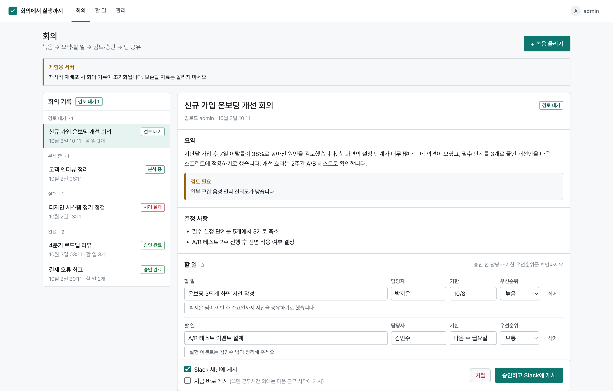

> 개인 포트폴리오 프로젝트입니다. 실서버(Render 무료 플랜)에서 녹음 업로드 → 전사 → AI 분석 → 승인 → Slack 게시까지 동작을 확인했습니다.

## 왜 만들었나

회의록 AI는 이미 많습니다(Otter, Fireflies, Fathom, Granola, 클로바노트 등). 녹음 → 전사 → 요약은 흔한 기능이 됐고, 문제는 **회의 뒤 실행**과 **회사 밖으로 나가는 데이터**입니다.
이 프로젝트는 다음 세 가지에 집중했습니다.

1. **사람이 승인하기 전에는 아무것도 나가지 않는다** — 요약·할 일은 검토 화면에서 고치고 승인해야 공유되고, 브리핑도 승인된 회의만 사용합니다.
2. **AI에는 가린 텍스트만 보낸다** — 개인정보 패턴을 가리고 사람 이름을 가명으로 바꾼 뒤 분석하고, 화면에서만 실명으로 되돌립니다. 원본 녹음은 처리 후 삭제합니다.
3. **회의가 끝난 뒤를 챙긴다** — 할 일의 기한을 해석해 아침 브리핑으로 알리고, 완료 처리하면 알림에서 빠집니다.

## 화면

| 할 일 | 품질 지표 (관리자) |
|---|---|
| 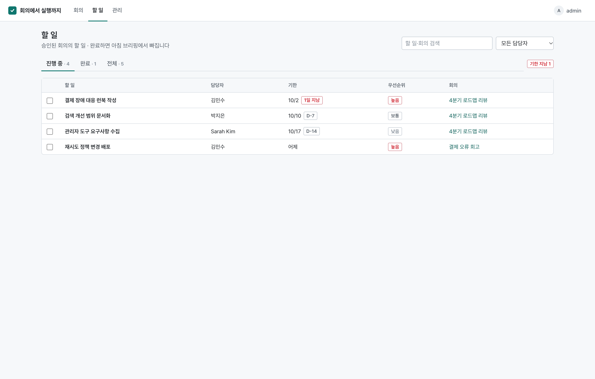 | 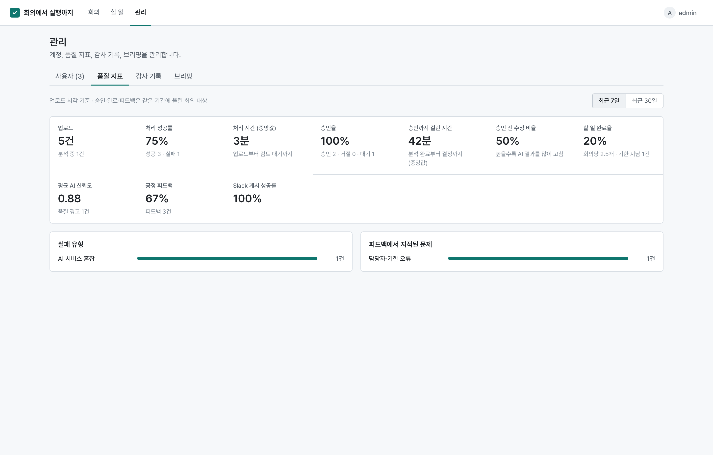 |
| **녹음 올리기** | **Slack DM 링크로 여는 녹음 페이지** |
| 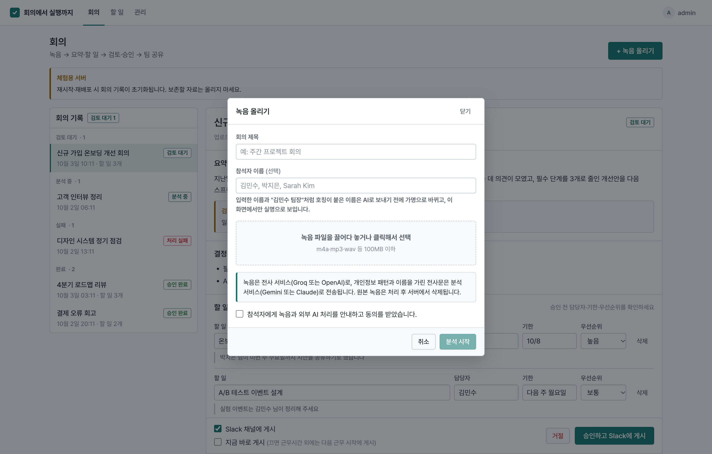 | 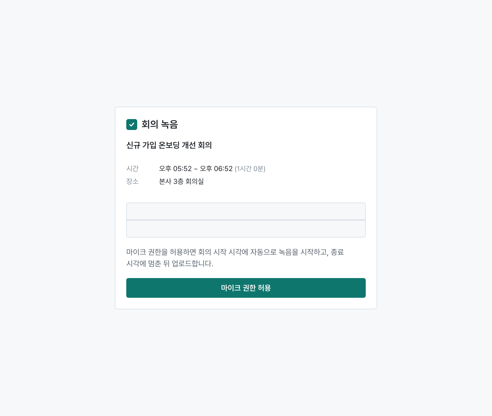 |
| **브리핑 미리 보기** | **다크 모드** |
| 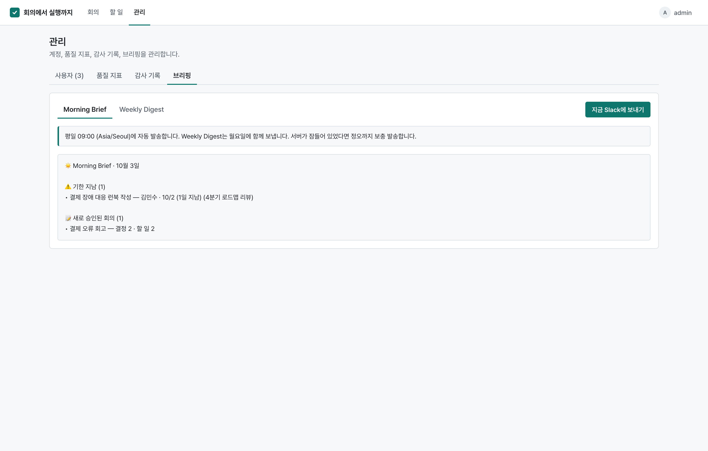 | 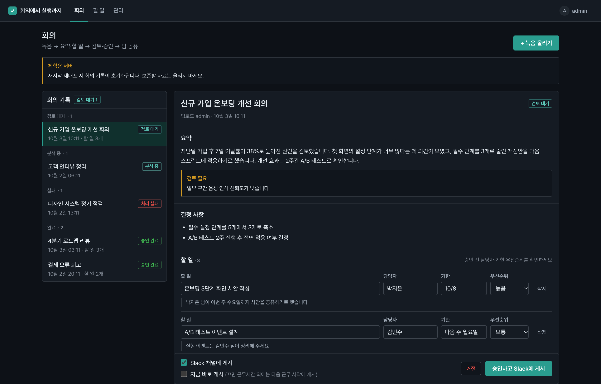 |

<details><summary>모바일 · 감사 기록 · 로그인</summary>

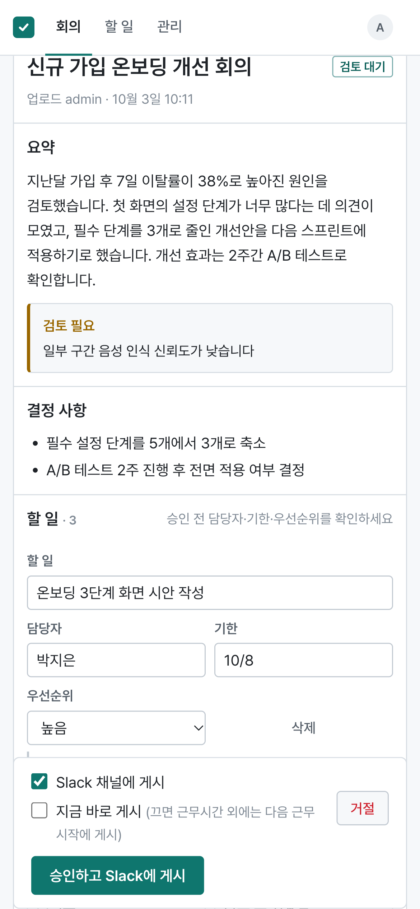 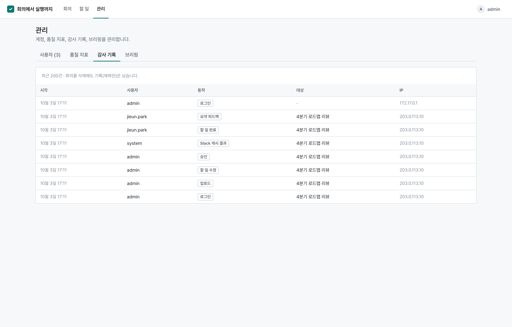 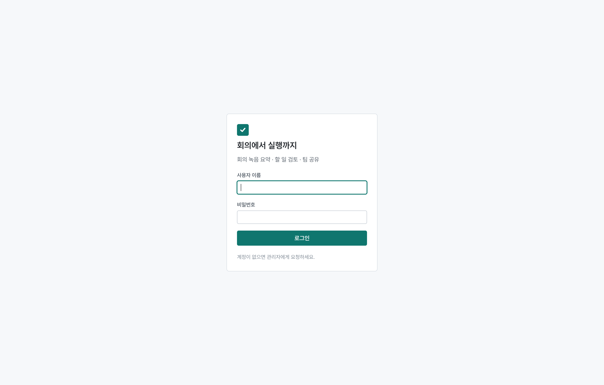

</details>

화면의 회의와 사람은 모두 예시 데이터입니다.

## 워크플로와 구현 현황

처음 설계한 22단계 워크플로를 기준으로 구현했습니다.

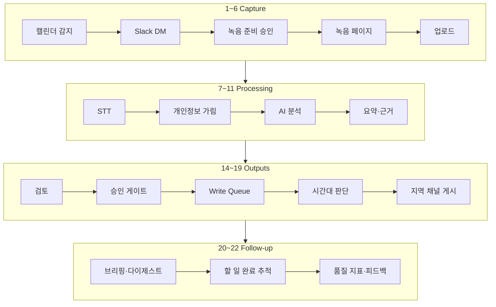

| 단계 | 상태 | 구현 |
|---|---|---|
| 1 캘린더 감지 | ✅ | Google·Outlook **ICS 구독**(반복 일정·예외일), Microsoft Graph |
| 2~3 Slack DM·녹음 준비 | ✅ | 회의 5분 전, 참석자 현지 시간, 버튼 승인 (Socket Mode) |
| 4~6 녹음·업로드 | ✅ | **서명된 회의 전용 링크**, 시작·종료 시각 자동 녹음, 16kHz WAV, 스트리밍 업로드 |
| 7 STT | ✅ | Groq/OpenAI Whisper, 25MB 제한 대응 10분 청크, 화자 분리(선택) |
| 8 가드 | ✅ | 정규식 PII 마스킹 + **이름 가명 처리** |
| 9 AI 분석 | ✅ | Gemini(기본)/Claude, JSON 스키마 강제, 재시도·예비 모델 |
| 10 지정 소스 검색 | ⏸ | 코드 있음 — Jira·Confluence 연결 시 ([#82](https://github.com/UnderCruzer/meeting-automation/issues/82)) |
| 11 요약 | ✅ | 근거 인용, 품질 경고, 실명 복원 |
| 12~13 Jira·Confluence 초안 | ⏸ | [#82](https://github.com/UnderCruzer/meeting-automation/issues/82) |
| 14 Slack Brief | ✅ | 요약·결정·할 일, 한국어/영어 |
| 15~16 검토·승인 | ✅ | 할 일 수정(담당·기한·우선순위), 산출물별 게시 선택 |
| 17~19 발송 | ✅ | Write Queue(재시도·예약), 근무시간 판단, NA/EU/APAC 채널 |
| 20~21 브리핑·후속 | ✅ | 평일 09:00 Morning Brief, 월요일 Weekly Digest, 기한 해석, 완료 추적 |
| 22 품질 | ✅ | 요약 피드백, 지표, 이상 경고, 주간 품질 리포트 |
| 운영 | 🔶 | 개인 계정·감사 기록·백업 제외 운영 기능 완료, 영구 저장소는 [#85](https://github.com/UnderCruzer/meeting-automation/issues/85) |

## 설계에서 고민한 것

각 항목은 실제로 문제를 발견하고 고친 과정이 이슈·PR에 남아 있습니다.

**승인 게이트를 끝까지 지키기**
기존 다이제스트·리마인더 코드가 디스크의 분석 파일을 읽어 **승인 전·거절된 회의까지** 발송하고 있었습니다. 브리핑을 승인된 회의만 쓰는 고정 템플릿(LLM 미사용)으로 다시 만들었습니다. 덕분에 추가 비용이 없고, 가명 토큰이나 공급자 오류 문구가 Slack에 새어 나가지 않습니다. ([#83](https://github.com/UnderCruzer/meeting-automation/issues/83))

**AI에는 가린 텍스트만**
정규식으로 연락처 등을 가리고, 참석자 목록과 "김민수 팀장" 같은 호칭 패턴으로 이름을 `[PERSON_n]`으로 바꿔 보냅니다. 대응표는 서버에만 두고 화면에서 복원합니다. 검토 화면의 근거 인용문이 원문(실명·이메일)에서 나오던 문제도 가린 전사문을 쓰도록 고쳤습니다. 분석 실패 시 재분석을 위해 보관하는 것도 가린 전사문뿐입니다. ([#63](https://github.com/UnderCruzer/meeting-automation/issues/63), [#65](https://github.com/UnderCruzer/meeting-automation/issues/65), [#75](https://github.com/UnderCruzer/meeting-automation/issues/75))

**로그인 없이 녹음하되, 그 회의만**
Slack DM의 녹음 링크는 회의·사용자·만료 시각을 HMAC으로 서명합니다. 웹은 서명을 검증한 업로드만 백엔드로 넘기고, 백엔드는 API 키가 맞을 때만 전달된 업로더를 믿으며 다른 회의로의 업로드를 거부합니다. 테스트 중 base64 패딩 비트만 다른 "같은 서명"이 통과하는 것을 발견해 비정규 표기도 거부합니다. 봇(JS)이 서명하고 웹(TS)이 검증하는 코드를 한 테스트에서 함께 돌려 호환성을 확인합니다. ([#80](https://github.com/UnderCruzer/meeting-automation/issues/80))

**512MB 서버에서 150분 녹음**
75분 녹음에서 컨테이너가 OOM으로 죽었습니다. 원인을 추적해 보니 Next.js App Router가 요청 본문을 흐름 제어 없이 메모리 큐에 쌓고 있었습니다. 업로드만 Pages API로 옮겨 `req.pipe()`로 백엔드에 넘기고, 백엔드 저장과 STT 청크 읽기도 스트리밍으로 바꿨습니다. ([#61](https://github.com/UnderCruzer/meeting-automation/issues/61))

| 녹음 | 크기 | 변경 전 (Next 서버 RSS) | 변경 후 |
|---|---|---|---|
| 30분 | 55MB | 168MB | 103MB |
| 75분 | 137MB | **OOM 종료** | 115MB |
| 150분 | 275MB | 364~420MB | 118MB |

**실서버에서 만난 장애**
첫 실사용에서 Gemini가 503(혼잡)을 냈습니다. 429·5xx·타임아웃 지수 백오프(`Retry-After` 존중), 예비 모델 전환, 실패 사유 코드, 재업로드 없는 "다시 분석"을 넣었습니다. Slack 게시 실패 원인이 보이지 않던 문제, INFO 로그가 아예 출력되지 않던 설정, 게시 성공 후 후처리 오류로 **같은 메시지를 다시 보낼 수 있던 버그**도 이 과정에서 고쳤습니다. ([#75](https://github.com/UnderCruzer/meeting-automation/issues/75), [#77](https://github.com/UnderCruzer/meeting-automation/issues/77))

**보안 기본기**
개인 계정(scrypt, 세션 토큰은 해시만 저장)과 CSRF 차단을 넣었습니다. CSP·HSTS 등 보안 헤더를 적용하고, 로그인 실패와 업로드를 IP별로 제한합니다. Render(Cloudflare) 뒤에서는 실제 접속자 IP를 식별합니다. 의존성 감사는 CI에 넣었고, 감사 기록은 회의를 삭제해도 남습니다. ([#58](https://github.com/UnderCruzer/meeting-automation/issues/58), [#66](https://github.com/UnderCruzer/meeting-automation/issues/66), [#67](https://github.com/UnderCruzer/meeting-automation/issues/67), [#71](https://github.com/UnderCruzer/meeting-automation/issues/71))

**무료 호스팅이라는 제약**
재시작하면 데이터가 사라지고, 15분 동안 요청이 없으면 서버가 잠듭니다. 그래서 정기 작업은 DB 기록으로 하루 한 번만 실행되게 하고, 잠들어 있다 깨어나면 정오까지 놓친 작업을 보충합니다. 재시작으로 사라진 게시 예약은 "실패"로 표시해 다시 보낼 수 있게 했습니다. 서버가 잠들지 않게 하는 주기적 핑(GitHub Actions)은 선택 사항입니다. ([#79](https://github.com/UnderCruzer/meeting-automation/issues/79), [#83](https://github.com/UnderCruzer/meeting-automation/issues/83))

**지표는 실제 처리 결과로**
기존 모니터링은 "실패율"을 발송 시도 횟수로 세서, 전사·분석 실패가 실패율에 잡히지 않았습니다. 그래서 회의 처리 결과·감사 기록·피드백을 기준으로 다시 계산합니다. 표본이 3건 미만이면 경고하지 않습니다. ([#84](https://github.com/UnderCruzer/meeting-automation/issues/84))

자세한 구조는 [docs/ARCHITECTURE.md](docs/ARCHITECTURE.md)에 있습니다.

## 기술 스택

| 영역 | 사용 |
|---|---|
| 웹 | Next.js 16 · React 19 · TypeScript, CSS 토큰(라이트/다크), Pretendard |
| 백엔드 | FastAPI · Python 3.11, SQLite, asyncio Write Queue·스케줄러 |
| Slack 봇 | Node 24 · Slack Bolt(Socket Mode) · node-ical |
| AI | Groq/OpenAI Whisper(전사), Gemini(기본)·Claude(분석) |
| 배포 | 단일 Docker 컨테이너, Render Blueprint, GitHub Actions(CI·절전 방지 핑) |

## 테스트

- 백엔드 **301개**(pytest): 파이프라인 단계·실패 코드, 개인정보 가림·이름 가명, 서명 링크·인증·CSRF, 스트리밍 업로드, Write Queue 예약·중복 방지, 기한 해석, 브리핑, 품질 지표
- Slack 봇 **8개**(`node --test`): ICS 반복 일정·예외일, 봇 서명 ↔ 웹 검증 상호 확인
- CI: 백엔드 테스트, `tsc`, Next 프로덕션 빌드, `pip-audit`, `npm audit`
- 수동 검증: 512MB 제한 컨테이너(장시간 녹음 메모리), 브라우저(라이트·다크·모바일), 실서버(Render)에서 끝까지 한 번

## 실행

```bash
cp .env.example .env    # BACKEND_API_KEY, ADMIN_PASSWORD, GEMINI_API_KEY, GROQ_API_KEY
docker compose -f compose.standalone.yml up --build -d
```

`http://localhost:3001` 에서 `admin`으로 로그인합니다. Render 원클릭 배포, Slack·캘린더 연결, 환경변수 전체는 [docs/OPERATIONS.md](docs/OPERATIONS.md)를 보세요.

## 한계와 다음 단계

- **Jira·Confluence 연결** ([#82](https://github.com/UnderCruzer/meeting-automation/issues/82)): 지정 소스 검색, 초안 생성, 승인 후 생성. 코드 일부는 있고 계정 연결이 남았습니다.
- **영구 저장소·백업** ([#85](https://github.com/UnderCruzer/meeting-automation/issues/85)): 지금은 무료 플랜이라 재시작하면 초기화됩니다.
- **화상회의 자동 참여 없음**: 대면 회의(브라우저 녹음)와 파일 업로드만 지원합니다.
- **근거 연결과 이름 탐지의 한계**: 근거 연결은 키워드 기반이고, 이름은 호칭이나 참석자 목록이 있어야 잡힙니다.
- **웹 E2E 테스트 없음**: 웹 화면은 타입 검사와 빌드, 수동 브라우저 확인으로만 검증했습니다.

## 개발 과정

2026년 6월~10월, 기능마다 **이슈 → 브랜치 → 작업 단위 커밋 → PR → CI** 순서로 진행했습니다(이슈 50개 이상, PR 40개 이상). 앞의 기능 구현이 끝난 뒤에는 실서버 배포와 사용 중 발견한 문제를 이슈로 남겨 하나씩 고쳤습니다. 변경 이력은 [CHANGELOG](.github/CHANGELOG.md)에 있습니다.
