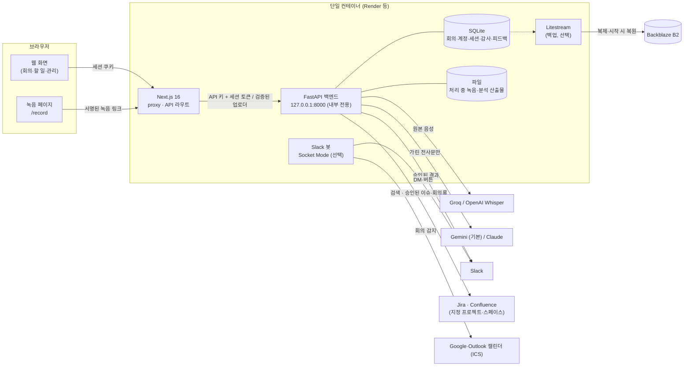
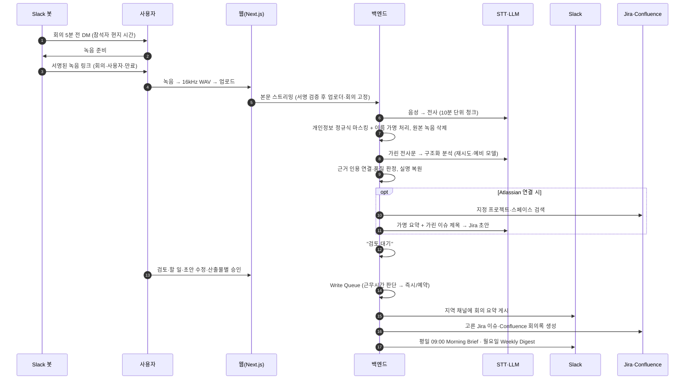
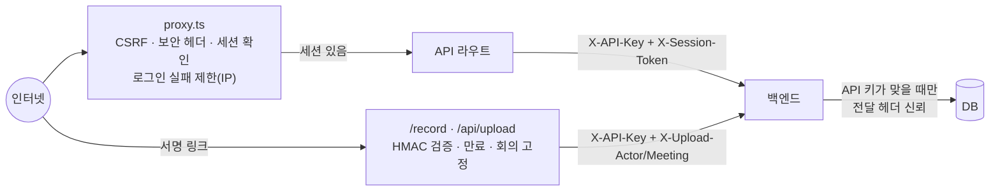

# 아키텍처

회의 녹음을 받아 요약·할 일을 만들고, 사람이 검토·승인한 결과만 팀(Slack)에 내보내는 시스템입니다.
설치·배포는 [OPERATIONS](OPERATIONS.md), 소개는 [README](../README.md)를 참고하세요.

## 구성 요소

하나의 컨테이너에서 세 프로세스(+ 백업을 켜면 Litestream)가 돌고, 외부에 열린 포트는 웹 서버 하나입니다.



| 프로세스 | 역할 | 비밀값 |
|---|---|---|
| `web` (Next.js) | 화면, 인증·CSRF·보안 헤더(proxy), 백엔드 프록시, 녹음 업로드 스트리밍 | 백엔드 API 키, 녹음 링크 서명 키 |
| `api` (FastAPI) | 파이프라인, 승인, Write Queue, 스케줄러(브리핑·품질 점검·보존 기간) | LLM·STT 키, 관리자 초기 비밀번호, Slack·Atlassian 토큰 |
| `bot` (Slack Bolt) | 캘린더 감지 → 회의 5분 전 DM → 녹음 준비 버튼 → 서명 링크 발송 | Slack 토큰, 캘린더 ICS 주소, 링크 서명 키 |
| `litestream` (선택) | 시작 전 복원, SQLite 실시간 복제. 반복해서 멈추면 관리자 채널에 알림 | 백업 저장소 키 |

`deploy/container/start.py`가 세 프로세스를 띄우고, 각 프로세스에는 필요한 비밀값만 넘깁니다. 웹 프로세스는 LLM·Slack·Atlassian 키를 받지 않고, 백업 키는 Litestream만 받습니다. 종료할 때는 백엔드를 먼저 내리고 Litestream을 마지막에 내려 마지막 변경까지 동기화합니다.

## 회의 한 건의 흐름



## 파이프라인 단계와 실패 처리

| 단계 | 구현 | 실패 시 |
|---|---|---|
| 업로드 | 1MB 단위로 디스크에 기록, 500MB 상한 | 413/422, 부분 파일 삭제 |
| 전사 | Groq Whisper(우선) → OpenAI, 24MB 이하 청크로 나눠 순차 전사, 화자 분리(pyannote, 선택) | `STT_FAILED`(재업로드 필요) |
| 보호 | 주민번호·카드·전화·이메일·비밀번호 마스킹 → 참석자·호칭 기반 이름을 `[PERSON_n]`으로 | — |
| 분석 | Gemini `responseSchema` / Claude `tool_use`로 JSON 강제, 429·5xx·타임아웃 지수 백오프 + `Retry-After`, 예비 모델 | `LLM_BUSY`·`ANALYSIS_FAILED` — **가린 전사문만 보관해 "다시 분석" 가능** |
| 요약 | 키워드 기반 근거 인용(가린 전사문에서), 품질 플래그, 서버 안에서 실명 복원 | — |
| 검색·초안 | 지정 프로젝트·스페이스만 검색, Jira 초안(가명 요약), Confluence 제목 | 검색·초안 실패해도 회의는 검토 대기 (초안 없이) |
| Jira·Confluence 생성 | 승인 후 Write Queue, 초안별 결과 기록, 없는 필드 제외 재시도 | 실패 이유 표시, 남은 항목만 다시 생성 |
| 재시작 | 처리 중이던 작업은 `RESTARTED`, 예약 게시는 실패로 전환 | 화면에 이유 표시 |

## 데이터

SQLite 파일 하나(`workspace.sqlite3`, WAL 모드)에 저장합니다. 백업을 켜면 Litestream이 이 파일을 S3 호환 저장소(Backblaze B2)에 1초 간격으로 복제하고, 컨테이너가 새로 뜰 때 백업에서 복원한 뒤 백엔드를 시작합니다. 복원에 실패하면 시작하지 않습니다([#85](https://github.com/UnderCruzer/meeting-automation/issues/85), 절차는 [OPERATIONS](OPERATIONS.md#데이터-보존백업-운영-전환)).

| 테이블 | 내용 |
|---|---|
| `jobs` | 회의 상태(processing/review/approved/rejected/failed), 요약 JSON(할 일·완료 여부 포함), 업로드·결정한 사람, 처리 시각, AI 신뢰도, 실패 코드, 재분석용 가린 전사문, Slack 게시 상태, Jira·Confluence 검색 결과·초안·생성 결과(`drafts`) |
| `users` / `sessions` | scrypt 해시 비밀번호, 역할, 세션 토큰의 SHA-256만 저장 |
| `audit_events` | 누가·언제·무엇을·어느 IP에서 (회의를 지워도 제목만 남김) |
| `feedback` | 사용자당 회의 1건의 요약 평가, 회의 삭제 시 함께 삭제 |
| `briefing_runs` | 브리핑·품질 경고를 하루 한 번만 보내기 위한 기록 |

파일은 처리 중인 녹음(처리 후 삭제)과 분석 산출물(가명 처리된 분석 JSON 등)만 남깁니다. 원문 전사는 `RETAIN_RAW_RECORDINGS=true`일 때만 저장합니다.

## 보안 경계



- **인증:** 개인 계정, 세션 쿠키는 HttpOnly·SameSite=Lax·(HTTPS에서) Secure. 사용자 이름당·IP당 로그인 실패 제한.
- **CSRF:** 상태를 바꾸는 요청은 `Sec-Fetch-Site`/`Origin`이 같은 출처일 때만 허용합니다. 로그인 요청도 포함합니다.
- **헤더:** CSP(`frame-ancestors 'none'`), HSTS, nosniff, Referrer-Policy, Permissions-Policy(마이크만 허용).
- **녹음 링크:** `base64url(payload).HMAC`, 비정규 base64 표기 거부, 회의 종료 2시간 후 만료. 다른 회의로 업로드하면 403.
- **IP:** Cloudflare 뒤(Render)에서는 `cf-connecting-ip`를 사용합니다. 백엔드는 API 키와 함께 온 `X-Client-IP`만 신뢰합니다.
- **의존성:** CI에서 `pip-audit`, `npm audit --audit-level=high`를 실행합니다.

## 백그라운드 작업 (백엔드 안)

| 루프 | 주기 | 내용 |
|---|---|---|
| Write Queue | 상시 | Slack·Jira·Confluence. 3회 지수 백오프, 예약 시각까지 대기, 발송 직전 재확인(삭제·승인 취소 시 건너뜀), 성공 후 중복 발송 방지 |
| 브리핑 | 1분마다 확인 | 평일 09:00(팀 시간대)·정오까지 보충, 월요일 주간 다이제스트 |
| 품질 점검 | 1시간 | 실패율·AI 혼잡·부정 피드백·신뢰도 → 관리자 채널(하루 1회) |
| 보존 기간 | 6시간 | `MEETING_RETENTION_DAYS`가 지난 회의 삭제 |

## 주요 API (백엔드, 웹이 프록시)

| 경로 | 설명 |
|---|---|
| `POST /upload` | 녹음 업로드(스트리밍) → 파이프라인 |
| `GET /workspace/jobs` · `DELETE /workspace/jobs/{id}` | 회의 목록(해석된 기한 포함)·삭제 |
| `PUT /workspace/jobs/{id}/action-items` · `PATCH …/action-items/{n}` | 승인 전 할 일 수정 · 승인 후 완료 처리 |
| `PUT /workspace/jobs/{id}/drafts` | 승인 전 Jira 초안 선택·수정, Confluence 제목 |
| `POST /workspace/jobs/{id}/decision` · `…/publish` · `…/retry` | 승인/거절(+Slack·Jira·Confluence 선택) · 재게시(`target`) · 재분석 |
| `GET·POST /workspace/jobs/{id}/feedback` | 요약 평가 |
| `GET /workspace/metrics` · `GET·POST /workspace/briefing` | 품질 지표 · 브리핑 미리 보기/발송 (관리자) |
| `/auth/*` | 로그인·로그아웃·비밀번호·사용자 관리·감사 기록 |

## 디렉터리

```
backend/            FastAPI — routers/, services/(파이프라인·LLM·Atlassian·브리핑·품질), tests/
recording-page/     Next.js 16 — app/(화면), pages/api/upload.ts(스트리밍), lib/(gate·session·grant), proxy.ts
slack-bot/          Slack Bolt — services/calendar/(ICS·Graph), handlers/, test/ (node --test)
deploy/container/   단일 컨테이너 Dockerfile·start.py
render.yaml         Render Blueprint
```
